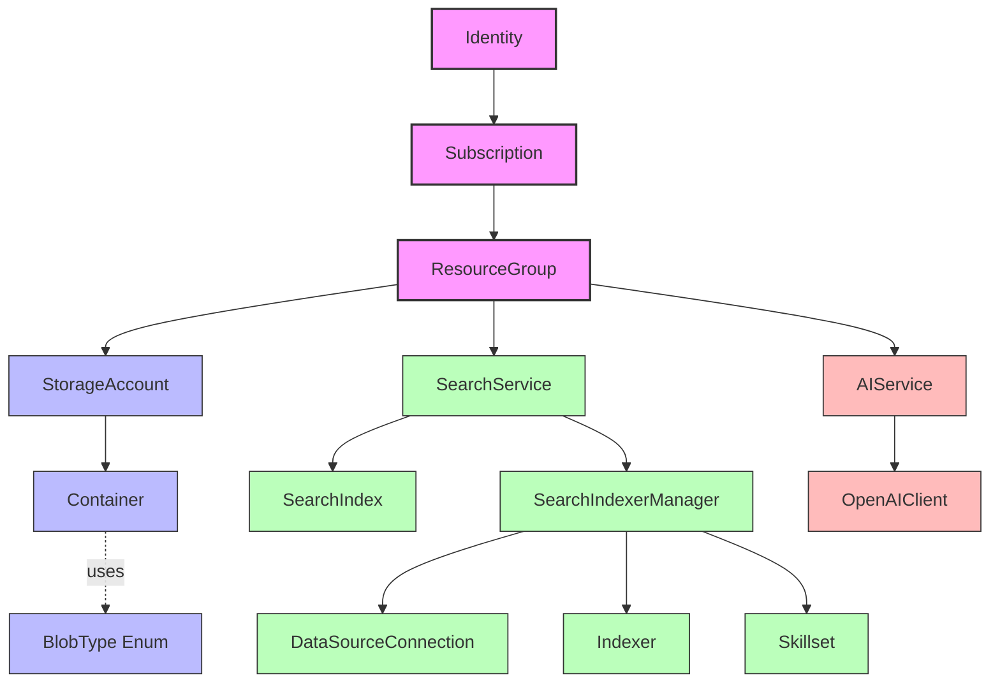

# Azure Services Wrapper Documentation

## Introduction

The `wrapper.py` file provides a comprehensive object-oriented interface for interacting with various Azure services. It abstracts away much of the complexity of the Azure SDK, providing a more intuitive and streamlined API for common operations.

### Purpose and Scope

This wrapper library is designed to simplify interactions with the following Azure services:

- Azure Resource Management (subscriptions, resource groups)
- Azure Storage (storage accounts, containers, blobs)
- Azure AI Search (search services, indexes, search operations)
- Azure OpenAI (AI services, embeddings, completions)

The wrapper follows Azure's resource hierarchy and provides classes that map directly to Azure resources, making it easier to understand and work with the Azure ecosystem.

## Architecture Overview

### Class Hierarchy and Relationships

The wrapper is organized in a hierarchical structure that mirrors Azure's resource organization:



This hierarchy reflects how resources are organized in Azure:
- An Identity authenticates and provides access to Subscriptions
- Subscriptions contain ResourceGroups
- ResourceGroups contain various resources like StorageAccounts, SearchServices, and AIServices
- Each resource type has its own specialized operations

### Design Patterns

The wrapper uses several design patterns:

1. **Facade Pattern**: Simplifies the complex Azure SDK APIs into a more manageable interface
2. **Factory Methods**: Methods like `get_resource_group()`, `get_storage_account()` that create or retrieve instances
3. **Composition**: Classes contain instances of other classes, reflecting the hierarchical nature of Azure resources

### Mapping to Azure Resources

Each class in the wrapper corresponds to a specific Azure resource or concept:

| Wrapper Class         | Azure Resource/Concept                |
| --------------------- | ------------------------------------- |
| Identity              | Azure AD Service Principal            |
| Subscription          | Azure Subscription                    |
| ResourceGroup         | Azure Resource Group                  |
| StorageAccount        | Azure Storage Account                 |
| Container             | Azure Blob Container                  |
| BlobType              | MIME Type Enumeration for Blobs       |
| SearchService         | Azure AI Search Service               |
| SearchIndex           | Azure AI Search Index                 |
| SearchIndexerManager  | Azure AI Search Indexer Management    |
| DataSourceConnection  | Azure AI Search Data Source           |
| Indexer               | Azure AI Search Indexer               |
| Skillset              | Azure AI Search Skillset              |
| AIService             | Azure OpenAI Service                  |
| OpenAIClient          | Azure OpenAI Client                   |

## Core Classes

### Authentication and Identity Management

#### Identity Class

The `Identity` class is the entry point for authentication with Azure services. It uses service principal authentication with a tenant ID, client ID, and client secret.

**Purpose**: Authenticate with Azure and provide access to subscriptions.

**Key Attributes**:
- `tenant_id`: Azure AD tenant ID
- `client_id`: Service principal client ID
- `client_secret`: Service principal client secret
- `credential`: Azure `ClientSecretCredential` object
- `subscription_client`: Azure `SubscriptionClient` for accessing subscriptions

**Key Methods**:
- `get_credential()`: Returns the Azure credential object
- `get_subscriptions()`: Lists all available subscriptions
- `get_subscription(subscription_id)`: Gets a specific subscription by ID

**Usage Example**:
```python
# Create an Identity object
identity = Identity(
    tenant_id=os.getenv("AZURE_TENANT_ID"),
    client_id=os.getenv("AZURE_CLIENT_ID"),
    client_secret=os.getenv("AZURE_CLIENT_SECRET")
)

# Get available subscriptions
subscriptions = identity.get_subscriptions()
for sub in subscriptions:
    print(f"Subscription: {sub.display_name} ({sub.subscription_id})")

# Get a specific subscription
subscription = identity.get_subscription(os.getenv("AZURE_SUBSCRIPTION_ID"))
```

### Resource Management

#### Subscription Class

The `Subscription` class represents an Azure subscription and provides access to resource groups and services within that subscription.

**Purpose**: Manage resource groups and access Azure services within a subscription.

**Key Attributes**:
- `identity`: Reference to the Identity object
- `subscription`: Azure subscription object
- `subscription_id`: Azure subscription ID
- `resource_client`: Azure `ResourceManagementClient` for managing resources
- `storage_client`: Azure `StorageManagementClient` for managing storage accounts

**Key Methods**:
- `get_resource_group(group_name)`: Gets a resource group by name
- `create_resource_group(group_name, location)`: Creates a new resource group
- `get_search_services()`: Lists all search services in the subscription
- `get_search_service(service_name)`: Gets a specific search service by name
- `get_storage_accounts()`: Lists all storage accounts in the subscription
- `get_cognitive_client()`: Gets a client for managing cognitive services

**Usage Example**:
```python
# Get a resource group
resource_group = subscription.get_resource_group("my-resource-group")

# Create a resource group if it doesn't exist
if resource_group is None:
    resource_group = subscription.create_resource_group("my-resource-group", "eastus")

# List all search services
search_services = subscription.get_search_sevices()
for service in search_services:
    print(f"Search Service: {service.name}")

# Get a specific search service
search_service = subscription.get_search_service("my-search-service")
```

#### ResourceGroup Class

The `ResourceGroup` class represents an Azure resource group and provides methods to manage resources within that group.

**Purpose**: Manage Azure resources within a resource group.

**Key Attributes**:
- `subscription`: Reference to the Subscription object
- `azure_resource_group`: Azure resource group object

**Key Methods**:
- `get_name()`: Gets the name of the resource group
- `get_resources()`: Lists all resources in the group
- `create_search_service(name, location)`: Creates a new search service
- `get_storage_account(account_name)`: Gets a storage account by name
- `create_storage_account(account_name, location)`: Creates a new storage account
- `get_ai_service(service_name)`: Gets an AI service by name

**Usage Example**:
```python
# Get the resource group name
group_name = resource_group.get_name()

# List all resources in the group
resources = resource_group.get_resources()
for resource in resources:
    print(f"Resource: {resource.name} (Type: {resource.type})")

# Create a search service
search_service = resource_group.create_search_service("my-search-service", "eastus")

# Get or create a storage account
storage_account = resource_group.get_storage_account("mystorageaccount")
if storage_account is None:
    storage_account = resource_group.create_storage_account("mystorageaccount", "eastus")
```

### Storage Services

#### StorageAccount Class

The `StorageAccount` class represents an Azure Storage Account and provides methods to work with blob storage.

**Purpose**: Manage blob storage containers and access blob data.

**Key Attributes**:
- `resource_group`: Reference to the ResourceGroup object
- `storage_account`: Azure storage account object
- `storage_key`: Storage account access key
- `connection_string_description`: Connection string for the storage account

**Key Methods**:
- `get_name()`: Gets the name of the storage account
- `get_blob_service_client()`: Gets a blob service client
- `get_containers()`: Lists all containers in the storage account
- `get_container(container_name)`: Gets a specific container by name

**Usage Example**:
```python
# Get the storage account name
account_name = storage_account.get_name()

# List all containers
containers = storage_account.get_containers()
for container in containers:
    print(f"Container: {container.name}")

# Get a specific container
container = storage_account.get_container("my-container")
```

#### Container Class

The `Container` class represents a blob container in Azure Storage.

**Purpose**: Access and manage blobs within a container.

**Key Attributes**:
- `storage_account`: Reference to the StorageAccount object
- `container_client`: Azure container client object

**Key Methods**:
- `get_blob_names()`: Lists all blob names in the container
- `get_blobs()`: Lists all blobs with their properties

**Usage Example**:
```python
# List all blob names in the container
blob_names = container.get_blob_names()
for name in blob_names:
    print(f"Blob: {name}")

# Get all blobs with properties
blobs = container.get_blobs()
for blob in blobs:
    print(f"Blob: {blob.name}, Size: {blob.size} bytes")
```

### Search Services

#### SearchService Class

The `SearchService` class represents an Azure AI Search service and provides methods to manage search indexes.

**Purpose**: Manage search indexes and perform search operations.

**Key Attributes**:
- `resource_group`: Reference to the ResourceGroup object
- `search_service`: Azure search service object
- `index_client`: Azure search index client
- `search_client`: Azure search client
- `openai_client`: OpenAI client for vector search

**Key Methods**:
- `get_admin_key()`: Gets the admin key for the search service
- `get_credential()`: Gets an Azure credential for the search service
- `get_service_endpoint()`: Gets the service endpoint URL
- `get_index_client()`: Gets a search index client
- `get_indexes()`: Lists all indexes in the search service
- `get_index(index_name)`: Gets a specific index by name
- `create_or_update_index(index_name, fields)`: Creates or updates an index
- `add_semantic_configuration()`: Adds semantic search configuration to an index

**Usage Example**:
```python
# Get the service endpoint
endpoint = search_service.get_service_endpoint()

# List all indexes
indexes = search_service.get_indexes()
for index in indexes:
    print(f"Index: {index.name}")

# Get a specific index
index = search_service.get_index("my-index")

# Create or update an index
from azure.search.documents.indexes.models import (
    SearchField, SearchFieldDataType, SimpleField, SearchableField
)

fields = [
    SimpleField(name="id", type=SearchFieldDataType.String, key=True),
    SearchableField(name="content", type=SearchFieldDataType.String, analyzer_name="en.microsoft")
]

index = search_service.create_or_update_index("my-index", fields)

# Add semantic configuration
search_service.add_semantic_configuration(
    title_field="title",
    content_fields=["content"],
    keyword_fields=["keywords"]
)
```

#### SearchIndex Class

The `SearchIndex` class represents an index in Azure AI Search and provides methods for search operations.

**Purpose**: Perform search operations and manage index data.

**Key Attributes**:
- `search_service`: Reference to the SearchService object
- `index_name`: Name of the index
- `fields`: List of fields in the index
- `vector_search`: Vector search configuration
- `azure_index`: Azure search index object

**Key Methods**:
- `get_search_client()`: Gets a search client for the index
- `extend_index_schema(new_fields)`: Extends the index schema with new fields
- `process_data_in_batches()`: Processes data in batches for large operations
- `copy_index_data()`: Copies data from one index to another
- `copy_index_structure()`: Copies the structure of the index to a new index
- `perform_search()`: Performs a basic search
- `search_with_context_window()`: Performs a search with context window
- `perform_hybrid_search()`: Performs a hybrid search (keyword + vector)

**Usage Example**:
```python
# Get a search client
search_client = index.get_search_client()

# Extend the index schema with new fields
from azure.search.documents.indexes.models import SimpleField, SearchFieldDataType

new_fields = [
    SimpleField(name="category", type=SearchFieldDataType.String, filterable=True)
]

index.extend_index_schema(new_fields)

# Perform a basic search
results = index.perform_search(
    search_text="example query",
    top=10
)

for result in results:
    print(f"Result: {result['id']}, Score: {result['@search.score']}")

# Perform a hybrid search (keyword + vector)
results = index.perform_hybrid_search(
    search_text="example query",
    vector_query=[0.1, 0.2, 0.3, ...],  # Vector embedding
    top=10
)
```

### AI Services

#### AIService Class

The `AIService` class represents an Azure OpenAI service and provides methods to manage deployments and models.

**Purpose**: Manage Azure OpenAI deployments and access OpenAI models.

**Key Attributes**:
- `resource_group`: Reference to the ResourceGroup object
- `cognitive_client`: Azure cognitive services client
- `azure_Account`: Azure OpenAI account object

**Key Methods**:
- `get_OpenAIClient(api_version)`: Gets an OpenAI client
- `get_models()`: Lists all available models
- `get_deployments()`: Lists all deployments
- `get_deployment(deployment_name)`: Gets a specific deployment
- `create_deployment()`: Creates a new deployment
- `delete_deployment(deployment_name)`: Deletes a deployment
- `update_deployment()`: Updates an existing deployment

**Usage Example**:
```python
# Get an OpenAI client
openai_client = ai_service.get_OpenAIClient("2023-05-15")

# List all available models
models = ai_service.get_models()
for model in models:
    print(f"Model: {model.name}")

# List all deployments
deployments = ai_service.get_deployments()
for deployment in deployments:
    print(f"Deployment: {deployment.name}, Model: {deployment.model}")

# Create a deployment
ai_service.create_deployment(
    deployment_name="my-gpt-deployment",
    model_name="gpt-35-turbo",
    model_version="0301",
    scale_type="Standard",
    capacity=1
)
```

#### OpenAIClient Class

The `OpenAIClient` class provides a wrapper for Azure OpenAI operations.

**Purpose**: Generate embeddings and chat completions using Azure OpenAI.

**Key Attributes**:
- `ai_service`: Reference to the AIService object
- `openai_client`: Azure OpenAI client object

**Key Methods**:
- `generate_embeddings(text, model)`: Generates embeddings for text
- `generate_chat_completion()`: Generates chat completions

**Usage Example**:
```python
# Generate embeddings for text
embeddings = openai_client.generate_embeddings(
    text="This is a sample text for embedding",
    model="text-embedding-3-small"
)

# Generate a chat completion
response = openai_client.generate_chat_completion(
    messages=[
        {"role": "system", "content": "You are a helpful assistant."},
        {"role": "user", "content": "Tell me about Azure AI Search"}
    ],
    model="gpt-35-turbo",
    temperature=0.7,
    max_tokens=500
)

print(response.choices[0].message.content)
```

### Indexer Management

#### SearchIndexerManager Class

The `SearchIndexerManager` class provides methods to manage indexers, data sources, and skillsets in Azure AI Search.

**Purpose**: Manage indexers, data sources, and skillsets for a search service.

**Key Attributes**:
- `search_service`: Reference to the SearchService object
- `indexer_client`: Azure SearchIndexerClient for managing indexers

**Key Methods**:
- `get_data_source_connections()`: Lists all data source connections
- `get_data_source_connection(name)`: Gets a specific data source connection
- `create_data_source_connection()`: Creates a new data source connection
- `get_indexers()`: Lists all indexers
- `get_indexer(name)`: Gets a specific indexer
- `create_indexer()`: Creates a new indexer
- `get_skillsets()`: Lists all skillsets
- `get_skillset(name)`: Gets a specific skillset
- `create_skillset()`: Creates a new skillset

**Usage Example**:
```python
# Get a search service
search_service = resource_group.get_search_service("my-search-service")

# Create an indexer manager
indexer_manager = search_service.create_indexer_manager()

# List all indexers
indexers = indexer_manager.get_indexers()
for indexer in indexers:
    print(f"Indexer: {indexer.get_name()}")

# Create a data source connection
container = azsdim.SearchIndexerDataContainer(name="my-container")
data_source = indexer_manager.create_data_source_connection(
    name="my-blob-datasource",
    type="azureblob",
    connection_string="DefaultEndpointsProtocol=https;AccountName=mystorageaccount;...",
    container=container
)

# Create an indexer
indexer = indexer_manager.create_indexer(
    name="my-indexer",
    data_source_name="my-blob-datasource",
    target_index_name="my-index"
)
```

#### DataSourceConnection Class

The `DataSourceConnection` class represents a data source connection in Azure AI Search.

**Purpose**: Manage a connection to a data source for indexing.

**Key Attributes**:
- `manager`: Reference to the SearchIndexerManager
- `data_source`: Azure data source connection object

**Key Methods**:
- `get_name()`: Gets the name of the data source connection
- `update()`: Updates the data source connection
- `delete()`: Deletes the data source connection

**Usage Example**:
```python
# Get a data source connection
data_source = indexer_manager.get_data_source_connection("my-blob-datasource")

# Update the connection string
data_source.update(connection_string="DefaultEndpointsProtocol=https;AccountName=mystorageaccount;...")

# Delete the data source
data_source.delete()
```

#### Indexer Class

The `Indexer` class represents an indexer in Azure AI Search.

**Purpose**: Manage an indexer that populates an index from a data source.

**Key Attributes**:
- `manager`: Reference to the SearchIndexerManager
- `indexer`: Azure indexer object

**Key Methods**:
- `get_name()`: Gets the name of the indexer
- `run()`: Runs the indexer
- `reset()`: Resets the indexer
- `get_status()`: Gets the status of the indexer
- `update()`: Updates the indexer
- `delete()`: Deletes the indexer

**Usage Example**:
```python
# Get an indexer
indexer = indexer_manager.get_indexer("my-indexer")

# Run the indexer
indexer.run()

# Check the status
status = indexer.get_status()
print(f"Indexer status: {status.last_result.status}")

# Reset the indexer
indexer.reset()

# Update the indexer schedule
from azure.search.documents.indexes.models import IndexingSchedule
schedule = IndexingSchedule(interval=timedelta(hours=12))
indexer.update(schedule=schedule)
```

#### Skillset Class

The `Skillset` class represents a skillset in Azure AI Search.

**Purpose**: Manage a set of cognitive skills for enriching data during indexing.

**Key Attributes**:
- `manager`: Reference to the SearchIndexerManager
- `skillset`: Azure skillset object

**Key Methods**:
- `get_name()`: Gets the name of the skillset
- `update()`: Updates the skillset
- `delete()`: Deletes the skillset

**Usage Example**:
```python
# Get a skillset
skillset = indexer_manager.get_skillset("my-skillset")

# Update the skillset with new skills
from azure.search.documents.indexes.models import OcrSkill, MergeSkill
skills = [
    OcrSkill(
        name="ocr-skill",
        description="Extract text from images",
        context="/document/normalized_images/*",
        text_extraction_algorithm="printed"
    ),
    MergeSkill(
        name="merge-skill",
        description="Merge extracted text",
        context="/document",
        inputs=[
            {"name": "text", "source": "/document/content"},
            {"name": "itemsToMerge", "source": "/document/normalized_images/*/text"}
        ],
        output={"name": "mergedText", "targetName": "content"}
    )
]
skillset.update(skills=skills)
```

### Blob Type Enumeration

#### BlobType Enum

The `BlobType` enum provides MIME type constants and utilities for working with blob content.

**Purpose**: Identify and work with different types of blob content.

**Key Values**:
- Text formats: `TEXT_PLAIN`, `TEXT_CSV`, `TEXT_HTML`, etc.
- Application formats: `APP_JSON`, `APP_PDF`, `APP_ZIP`, etc.
- Microsoft Office formats: `MS_WORD`, `MS_EXCEL`, `MS_POWERPOINT`
- Image formats: `IMAGE_JPEG`, `IMAGE_PNG`, `IMAGE_GIF`, etc.
- Audio formats: `AUDIO_MP3`, `AUDIO_WAV`, `AUDIO_OGG`
- Video formats: `VIDEO_MP4`, `VIDEO_WEBM`, `VIDEO_OGG`

**Key Methods**:
- `from_extension(extension)`: Get MIME type from file extension
- `from_mime_type(mime_type)`: Get BlobType from MIME type string

**Usage Example**:
```python
# Get a container
container = storage_account.get_container("my-container")

# Get blob type from extension
blob_type = BlobType.from_extension(".pdf")
print(f"PDF MIME type: {blob_type.value}")

# Get blob type from a blob
blob_name = "documents/report.docx"
blob_type = container.get_blob_type(blob_name)
print(f"Blob type: {blob_type.name}")

# Process blob based on its type
content = container.process_blob_by_type(blob_name)
```

## Common Workflows

### Authentication and Resource Access

The typical workflow starts with authentication and accessing resources:

```python
# 1. Create an Identity object for authentication
identity = Identity(
    tenant_id=os.getenv("AZURE_TENANT_ID"),
    client_id=os.getenv("AZURE_CLIENT_ID"),
    client_secret=os.getenv("AZURE_CLIENT_SECRET")
)

# 2. Get a subscription
subscription = identity.get_subscription(os.getenv("AZURE_SUBSCRIPTION_ID"))

# 3. Get a resource group
resource_group = subscription.get_resource_group("my-resource-group")
```

### Creating and Managing Resources

Once you have access to a resource group, you can create and manage resources:

```python
# Create a search service
search_service = resource_group.create_search_service("my-search-service", "eastus")

# Create a storage account
storage_account = resource_group.create_storage_account("mystorageaccount", "eastus")

# Get a container or create one if it doesn't exist
blob_service_client = storage_account.get_blob_service_client()
container_client = blob_service_client.get_container_client("my-container")
if not container_client.exists():
    container_client.create_container()

container = storage_account.get_container("my-container")
```

### Working with Search Indexes

Creating and using search indexes:

```python
# Define fields for the index
from azure.search.documents.indexes.models import (
    SearchField, SearchFieldDataType, SimpleField, SearchableField
)

fields = [
    SimpleField(name="id", type=SearchFieldDataType.String, key=True),
    SearchableField(name="title", type=SearchFieldDataType.String, analyzer_name="en.microsoft"),
    SearchableField(name="content", type=SearchFieldDataType.String, analyzer_name="en.microsoft")
]

# Create the index
index = search_service.create_or_update_index("my-index", fields)

# Upload documents to the index
search_client = index.get_search_client()
documents = [
    {
        "id": "1",
        "title": "Example Document 1",
        "content": "This is the content of document 1."
    },
    {
        "id": "2",
        "title": "Example Document 2",
        "content": "This is the content of document 2."
    }
]
search_client.upload_documents(documents)

# Perform a search
results = index.perform_search(search_text="example document")
```

### Setting up Indexers and Data Sources

Creating and using indexers to automatically populate search indexes:

```python
# Get an indexer manager
indexer_manager = search_service.create_indexer_manager()

# Create a data source connection for Azure Blob Storage
from azure.search.documents.indexes.models import SearchIndexerDataContainer
container = SearchIndexerDataContainer(name="my-container")
data_source = indexer_manager.create_data_source_connection(
    name="my-blob-datasource",
    type="azureblob",
    connection_string="DefaultEndpointsProtocol=https;AccountName=mystorageaccount;...",
    container=container
)

# Create a skillset for document enrichment
from azure.search.documents.indexes.models import OcrSkill, MergeSkill
skills = [
    OcrSkill(
        name="ocr-skill",
        description="Extract text from images",
        context="/document/normalized_images/*",
        text_extraction_algorithm="printed"
    ),
    MergeSkill(
        name="merge-skill",
        description="Merge extracted text",
        context="/document",
        inputs=[
            {"name": "text", "source": "/document/content"},
            {"name": "itemsToMerge", "source": "/document/normalized_images/*/text"}
        ],
        output={"name": "mergedText", "targetName": "content"}
    )
]
skillset = indexer_manager.create_skillset(
    name="my-skillset",
    skills=skills,
    description="Skillset for OCR and text merging"
)

# Create an indexer that uses the data source and skillset
from azure.search.documents.indexes.models import IndexingSchedule
from datetime import timedelta

schedule = IndexingSchedule(interval=timedelta(hours=12))
indexer = indexer_manager.create_indexer(
    name="my-indexer",
    data_source_name="my-blob-datasource",
    target_index_name="my-index",
    skillset_name="my-skillset",
    schedule=schedule
)

# Run the indexer
indexer.run()

# Check the indexer status
status = indexer.get_status()
print(f"Indexer status: {status.last_result.status if status.last_result else 'No results yet'}")
```

### Integrating with Azure OpenAI

Using Azure OpenAI for embeddings and search:

```python
# Get an AI service
ai_service = resource_group.get_ai_service("my-openai-service")

# Get an OpenAI client
openai_client = ai_service.get_OpenAIClient("2023-05-15")

# Generate embeddings for a query
query_embedding = openai_client.generate_embeddings("What is Azure AI Search?")

# Perform a vector search
results = index.perform_hybrid_search(
    search_text="What is Azure AI Search?",
    vector_query=query_embedding,
    vector_field="embedding",
    top=5
)
```

## Best Practices

### Error Handling

The wrapper includes some error handling, but it's recommended to add additional error handling in your code:

```python
try:
    storage_account = resource_group.get_storage_account("mystorageaccount")
except Exception as e:
    print(f"Error accessing storage account: {str(e)}")
    # Handle the error appropriately
```

### Resource Management

Azure resources can incur costs, so it's important to manage them properly:

1. Delete resources when they're no longer needed
2. Use appropriate SKUs and scaling options based on your needs
3. Monitor resource usage and costs

### Performance Considerations

For better performance:

1. Reuse client objects rather than creating new ones for each operation
2. Use batch operations when working with large amounts of data
3. Consider using async versions of the Azure SDK for high-throughput scenarios
4. Implement proper retry logic for transient failures

### Security Best Practices

1. Store credentials securely (e.g., using environment variables or Azure Key Vault)
2. Use the principle of least privilege when creating service principals
3. Rotate keys and secrets regularly
4. Use managed identities where possible instead of service principals

## Conclusion

The wrapper.py file provides a comprehensive object-oriented interface for working with Azure services. By abstracting away much of the complexity of the Azure SDK, it makes it easier to:

1. Authenticate with Azure
2. Manage Azure resources
3. Work with Azure Storage and handle different blob types
4. Create and use Azure AI Search indexes
5. Set up and manage indexers, data sources, and skillsets
6. Integrate with Azure OpenAI services

The hierarchical structure of the classes mirrors Azure's resource organization, making it intuitive to understand and use. By following the examples and best practices in this documentation, you can effectively leverage the wrapper to build applications that utilize Azure's powerful cloud services.

### Extending the Wrapper

If you need to extend the wrapper to support additional Azure services or functionality:

1. Follow the existing class hierarchy pattern
2. Create new classes that represent Azure resources
3. Use composition to maintain the relationship between resources
4. Add factory methods to create or retrieve instances
5. Implement methods that map to common operations on the resource

For example, to add support for Azure Cosmos DB:

```python
class CosmosDBAccount:
    resource_group: ResourceGroup
    cosmos_account: Any  # Azure Cosmos DB account object
    
    def __init__(self, resource_group: ResourceGroup, cosmos_account: Any):
        self.resource_group = resource_group
        self.cosmos_account = cosmos_account
        
    # Add methods for common operations
    def get_database(self, database_name: str) -> "CosmosDatabase":
        # Implementation
        pass
        
    def create_database(self, database_name: str) -> "CosmosDatabase":
        # Implementation
        pass
```

Then add methods to the ResourceGroup class to create or retrieve CosmosDBAccount instances:

```python
def get_cosmos_account(self, account_name: str) -> "CosmosDBAccount":
    # Implementation
    pass
    
def create_cosmos_account(self, account_name: str, location: str) -> "CosmosDBAccount":
    # Implementation
    pass
```

By following this pattern, you can maintain the consistency and intuitiveness of the wrapper while extending its functionality.