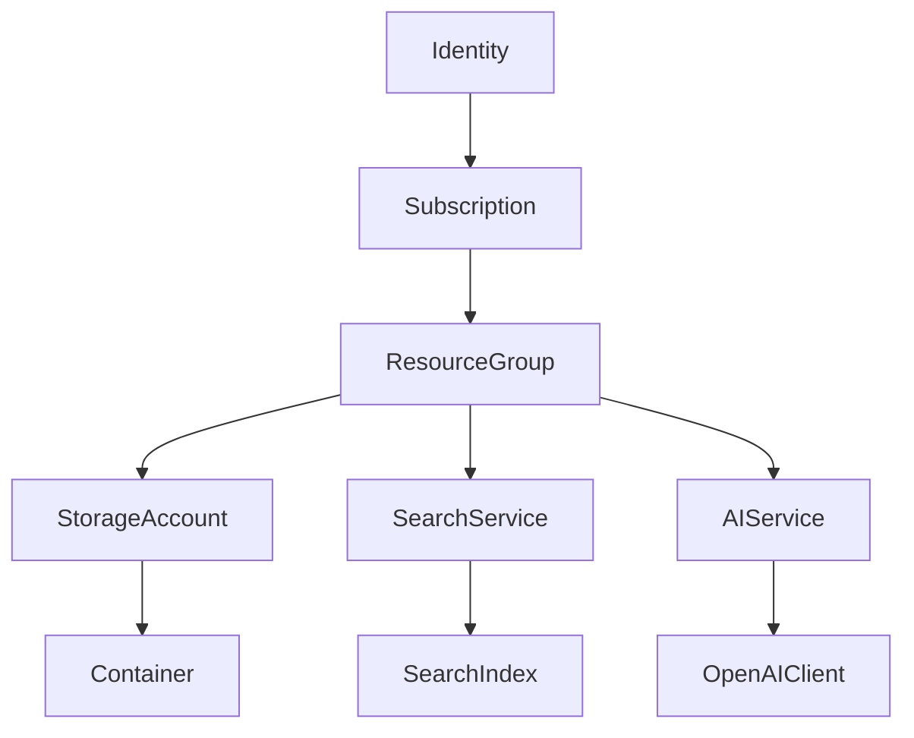

# Azure Services Wrapper Documentation

## Introduction

The `wrapper.py` file provides a comprehensive object-oriented interface for interacting with various Azure services. It abstracts away much of the complexity of the Azure SDK, providing a more intuitive and streamlined API for common operations.

### Purpose and Scope

This wrapper library is designed to simplify interactions with the following Azure services:

- Azure Resource Management (subscriptions, resource groups)
- Azure Storage (storage accounts, containers, blobs)
- Azure AI Search (search services, indexes, search operations)
- Azure OpenAI (AI services, embeddings, completions)

The wrapper follows Azure's resource hierarchy and provides classes that map directly to Azure resources, making it easier to understand and work with the Azure ecosystem.

## Architecture Overview

### Class Hierarchy and Relationships

The wrapper is organized in a hierarchical structure that mirrors Azure's resource organization:

This hierarchy reflects how resources are organized in Azure:
- An Identity authenticates and provides access to Subscriptions
- Subscriptions contain ResourceGroups
- ResourceGroups contain various resources like StorageAccounts, SearchServices, and AIServices
- Each resource type has its own specialized operations

### Design Patterns

The wrapper uses several design patterns:

1. **Facade Pattern**: Simplifies the complex Azure SDK APIs into a more manageable interface
2. **Factory Methods**: Methods like `get_resource_group()`, `get_storage_account()` that create or retrieve instances
3. **Composition**: Classes contain instances of other classes, reflecting the hierarchical nature of Azure resources

### Mapping to Azure Resources

Each class in the wrapper corresponds to a specific Azure resource or concept:

| Wrapper Class  | Azure Resource/Concept     |
| -------------- | -------------------------- |
| Identity       | Azure AD Service Principal |
| Subscription   | Azure Subscription         |
| ResourceGroup  | Azure Resource Group       |
| StorageAccount | Azure Storage Account      |
| Container      | Azure Blob Container       |
| SearchService  | Azure AI Search Service    |
| SearchIndex    | Azure AI Search Index      |
| AIService      | Azure OpenAI Service       |
| OpenAIClient   | Azure OpenAI Client        |